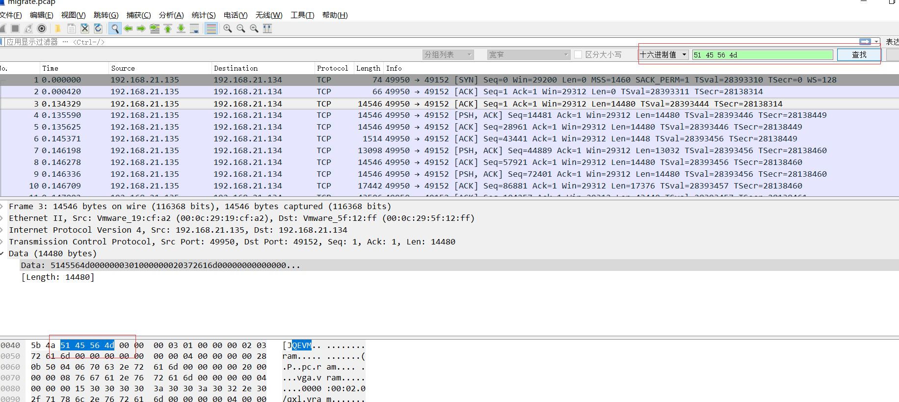

## 1. qemu的monitor入口
monitor的migrate命令的定义在hmp-commands.hx中，在编译过程中.hx文件通过hxtool工具生成头文件x86_64-softmmu/hmp-commands.h，migrate对应内容为
```
{
.name       = "migrate",
.args_type  = "detach:-d,blk:-b,inc:-i,uri:s",
.params     = "[-d] [-b] [-i] uri",
.help       = "migrate to URI (using -d to not wait for completion)"
"\n\t\t\t -b for migration without shared storage with"
" full copy of disk\n\t\t\t -i for migration without "
"shared storage with incremental copy of disk "
"(base image shared between src and destination)",
.cmd        = hmp_migrate,
},
```
migrate命令对应的函数为hmp_migrate，在hmp_migrate中进入qmp_migrate函数进行migrate操作。

## 2. 函数调用过程
创建迁移线程migration
```
hmp_migrate
-->qmp_migrate  uri值为fd:migrate
   -->fd_start_outgoing_migration  fdname值为migrate
      -->migrate_fd_connect
         -->qemu_thread_create  创建迁移线程migration_thread
```
线程migration_thread流程
```
migration_thread
-->qemu_savevm_state_header  发送魔术字0x5145564d
-->qemu_savevm_state_begin
   -->ram_save_setup<==>se->ops->save_live_setup
      -->migration_bitmap_sync
## while循环
--->qemu_savevm_state_pending  计算需要传输的剩余空间的大小
    -->ram_save_pending<==>se->ops->save_live_pending
### 当pending_size >= max_size时
---->qemu_savevm_state_iterate
     -->ram_save_iterate<==>se->ops->save_live_iterate
        -->ram_find_and_save_block  查找脏页并发送
### pending_size < max_size时
---->migration_completion
---->退出while循环
--->计算max_size值 trace_migrate_transferred
```

## 3. 数据结构

### 3.1 SaveStateEntry
其中有SaveVMHandlers *ops变量，保存虚拟机迁移的几个函数，其中ram对应的函数
```c
static SaveVMHandlers savevm_ram_handlers = {
    .save_live_setup = ram_save_setup,
    .save_live_iterate = ram_save_iterate,
    .save_live_complete_postcopy = ram_save_complete,
    .save_live_complete_precopy = ram_save_complete,
    .save_live_pending = ram_save_pending,
    .load_state = ram_load,
    .cleanup = ram_migration_cleanup,
};
```
全局变量 **static SaveState savevm_state** 的handlers保存了SaveStateEntry的链表，在 **register_savevm_live** 和 **vmstate_register_with_alias_id**中使用 **QTAILQ_INSERT_TAIL** 将SaveStateEntry添加到链表。

### 3.2 MigrationState
MigrationState记录迁移相关状态的结构体，可通过 **migrate_get_current()** 获取函数当前迁移状态。
```c
struct MigrationState
{
    int64_t bandwidth_limit; 
    size_t bytes_xfer;
    size_t xfer_limit;
    QemuThread thread;
    QEMUBH *cleanup_bh;
    QEMUFile *to_dst_file;
    int parameters[MIGRATION_PARAMETER__MAX];

    int state;
    MigrationParams params;
    ......
}
```

## 4. 函数说明

### 4.1 qemu_savevm_state_header
在迁移的开始发送魔术字0x5145564d，通过tcpdump抓包进行观察，抓取目的端口为49152的包并保存到migrate.pcap，可使用wireshark分析抓到的包。
```
# tcpdump -i ens33 dst port 49152 -w migrate.pcap -v
```
使用wireshark分析抓到的包，可查看到0x5145564d


